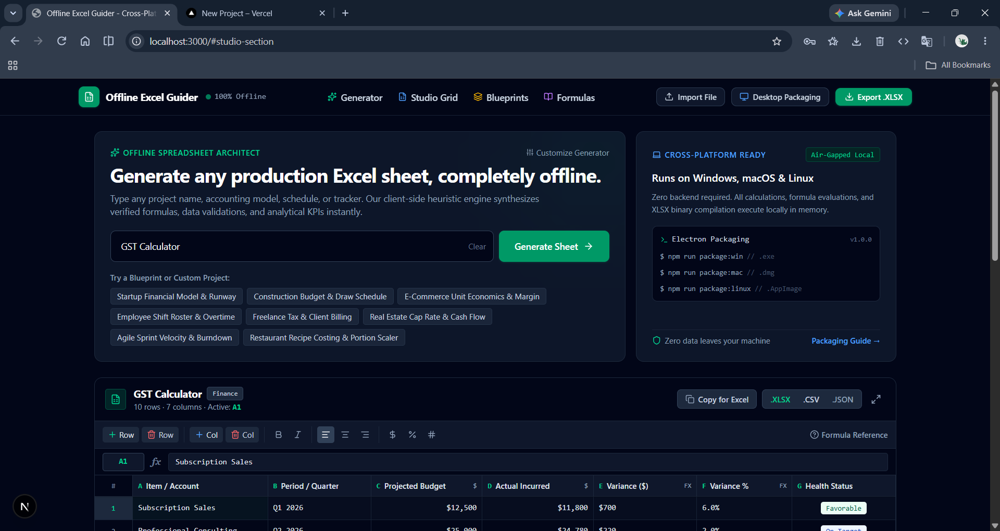
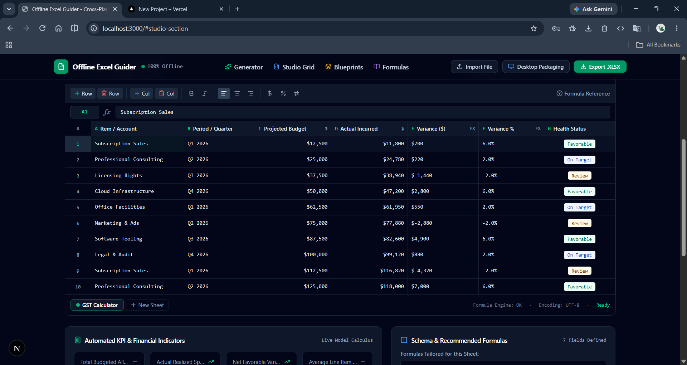
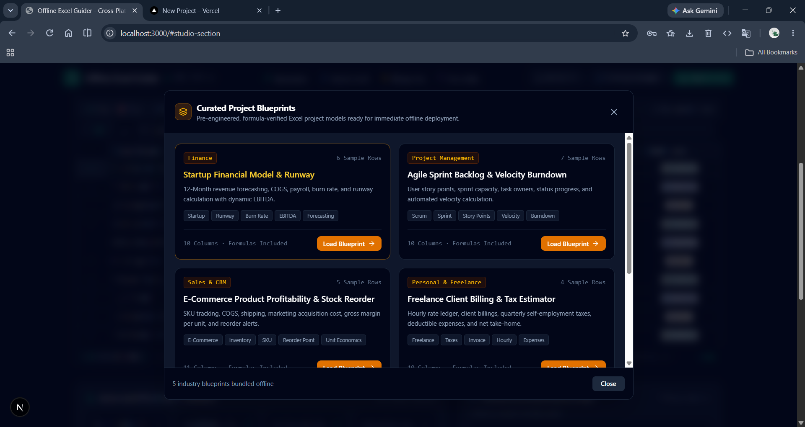
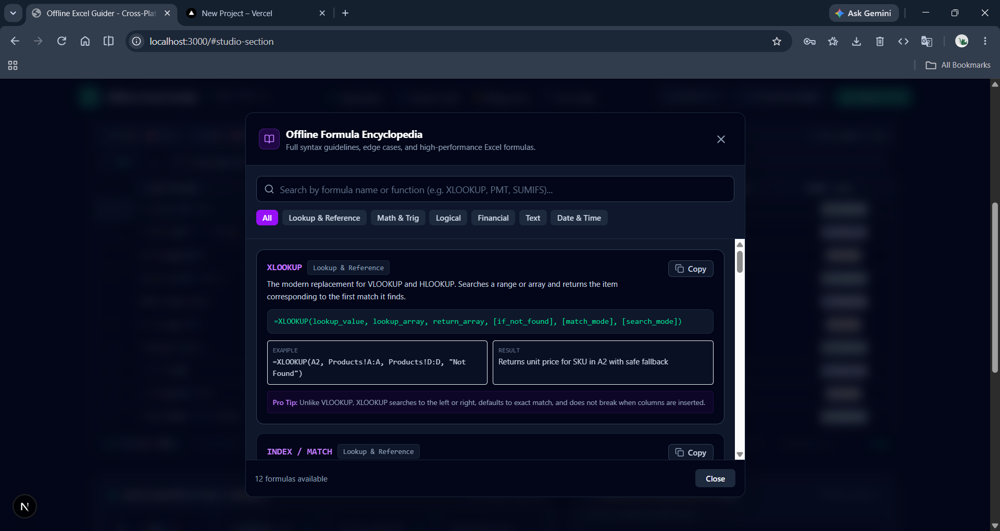
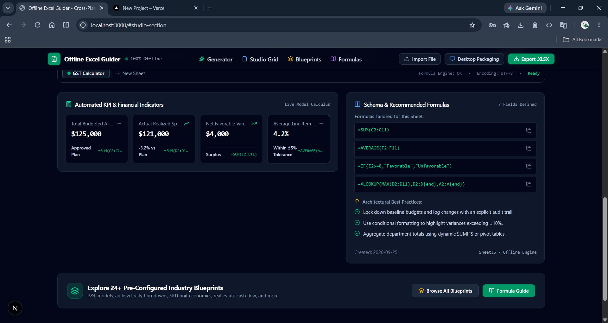

# Offline Excel Guider

Offline Excel Guider is a cross-platform spreadsheet generator and workbook studio built with Next.js and Electron. Create structured Excel models locally, edit them in an interactive grid, inspect formulas, and export the result without sending workbook data to a server.

## Preview






## Demo
[!Demo](assets/excel-gen.mp4)

## Features

- Generate spreadsheet projects from a description using the local heuristic generator.
- Start from curated industry blueprints for finance, project management, e-commerce, and other workflows.
- Edit cells, formulas, rows, columns, sheet names, and column names in the browser-based grid.
- Navigate the grid with arrow keys, `Enter`, and `Tab`.
- Apply common number formats, alignment, bold, and italic styling.
- View project KPIs, recommended formulas, and spreadsheet design practices.
- Search an offline formula encyclopedia covering lookup, math, logical, financial, text, and date functions.
- Import `.xlsx`, `.xls`, and `.csv` files locally.
- Export workbooks to `.xlsx`, `.csv`, or project `.json` files.
- Run as a desktop application on Windows, macOS, or Linux through Electron.

## Requirements

- Node.js 18 or newer
- npm

## Getting Started

Install dependencies:

```bash
npm install
```

Start the Next.js development server:

```bash
npm run dev
```

Open `http://localhost:3000` in your browser.

## Desktop Development

Build the Next.js application and launch the Electron shell:

```bash
npm run build
npm run electron
```

The Electron main process is defined in `electron-main.js`, with the isolated context bridge in `electron-preload.js`.

## Production Commands

| Command | Description |
| --- | --- |
| `npm run dev` | Start the Next.js development server. |
| `npm run build` | Create a production Next.js build. |
| `npm run start` | Serve the production Next.js build. |
| `npm run lint` | Run ESLint across the project. |
| `npm run clean` | Remove the Next.js build cache. |
| `npm run electron` | Launch the Electron desktop shell. |
| `npm run package:win` | Build and package for Windows. |
| `npm run package:mac` | Build and package for macOS. |
| `npm run package:linux` | Build and package for Linux. |

## How to Use

1. Enter a project name or describe the spreadsheet you need in the generator.
2. Optionally customize the sample row count, currency, and formula complexity.
3. Generate the sheet or load a blueprint from the Blueprint Hub.
4. Edit the workbook in the Studio Grid. Formula cells can be entered directly or through the formula bar.
5. Review the generated KPIs, recommended formulas, and best practices.
6. Export the finished workbook from the top navigation or the File menu in the desktop app.

Existing workbooks can be loaded with **Import File**. Imported data is parsed in the client and converted into the app's workbook model.

## Keyboard Shortcuts

- `Ctrl/Cmd + S`: Export the current project to `.xlsx`.
- `Ctrl/Cmd + N`: Focus the project generator input.
- Arrow keys: Move the selected cell.
- `Enter`: Edit the selected cell.
- `Tab`: Move to the next cell.

## Project Structure

```text
app/                    Next.js app entry point and global styles
components/             Generator, spreadsheet grid, drawers, and UI components
lib/excelGeneratorEngine.ts
						Offline project generation and curated blueprints
lib/excelExporter.ts   XLSX/CSV/JSON import and export helpers
lib/formulaGuide.ts    Offline formula reference catalog
types/excel.ts         Workbook, sheet, cell, and generator types
electron-main.js       Electron window and native application menu
electron-preload.js    Secure Electron context bridge
```

## Offline Behavior

The workbook generator, formula catalog, import flow, and export flow are implemented locally in the client. The project does not require a backend for its core spreadsheet workflow. Keep any optional environment configuration in a local `.env.local` file and never commit secrets.

## License

No license file is currently included in this repository.
